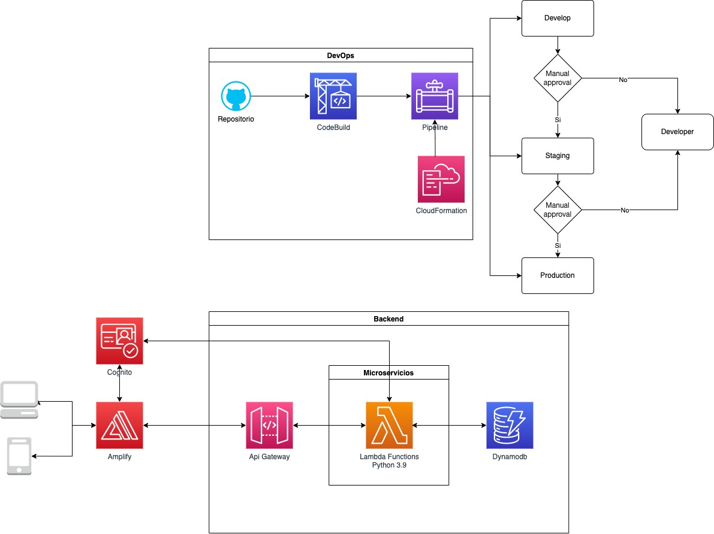

# transportApp
Esta es la base para el backend del aplicativo de transporte SaaS para crear los tenants.

## Arquitectura

El aplicativo está implementado con arquitectura serverless con el uso de la nube de AWS y programado en el lenguaje Nodejs 16.

El backend está construido por microservicios con el uso de funciones Lambd (Nodejs 16), API Gateway, Cognito (Gestor de usuarios y permisos) y DynamoDB.

## Pipeline
El pipeline revisa los cambios ocurridos en la rama main y realiza el despliegue en el ambiente de develop. Para desplegar en el ambiente de staging y production se realiza a través de una aprobación manual.